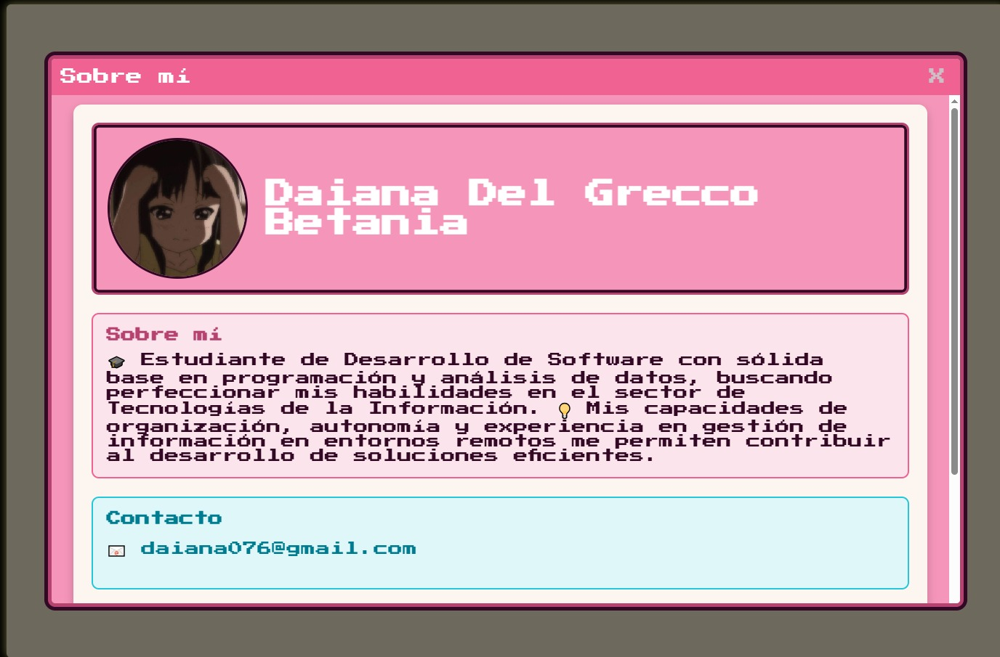
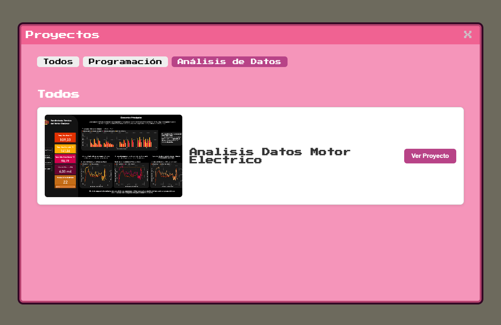

# Portfolio de Programación 

¡Bienvenido a mi portfolio! Este proyecto es una muestra de mis habilidades y proyectos.

## Contexto

**Antes:**

Se presentaban dos fuentes de datos y lógicas casi idénticas, una en el componente principal y otra en la página de proyectos, causando redundancia y complicando la gestión. Además, el flujo de ventanas era confuso, con la misma función para cerrar tanto ventanas internas como la pantalla completa de la PC.

**Ahora:**

Hemos **centralizado toda la lógica de obtención de datos y gestión de estado en una sola fuente**, eliminando la duplicación. Se mejoró la lógica de interacción con el usuario, diferenciando entre el cierre de una ventana interna (`closeWindow`) y el cierre de la pantalla de la PC completa (`closePcScreen`), lo que resulta en una experiencia más intuitiva.

## Descripción

El portfolio es un sitio web interactivo con un diseño de *pixel art*. La página principal está diseñada como un juego isométrico que representa mi habitación. Los usuarios pueden explorar el entorno y hacer clic en objetos interactivos para descubrir información sobre mis habilidades y proyectos.

## Características

* **Estilo de *Pixel Art***: Un diseño retro y nostálgico.
* **Perspectiva Isométrica**: Representación 2D para un entorno visualmente atractivo.
* **Interactividad**: Objetos clicables que revelan detalles sobre mi trabajo y habilidades.
* **Flujo de Usuario Mejorado**: Una navegación más clara y consistente con la metáfora de un sistema operativo.

## Tecnologías Utilizadas

* **HTML**: Para la estructura del contenido.
* **CSS**: Para el diseño y estilo visual.
* **JavaScript**: Para la interactividad y lógica del juego.
* **Astro**: Como *framework* principal para la renderización y la gestión del proyecto, aprovechando su enfoque de **islas** para integrar componentes.
* **React**: Usado dentro de Astro para gestionar la interactividad y los estados de las ventanas.
* **Node.js**: Se usa en el *backend* para gestionar los *scripts* del proyecto y para la integración con **Strapi**.
* **Strapi**: Un CMS *headless* que utilizamos para la gestión de los datos de mi perfil y proyectos, permitiendo una actualización sencilla sin modificar el código.

## Uso

Explora la página de inicio para descubrir mis habilidades y proyectos. Haz clic en los objetos interactivos para obtener más información.

## Contacto

Puedes contactarme en [daiana076@gmail.com].

## Derechos de autor

© 2024 [Del Grecco Daiana]. Todos los derechos reservados.